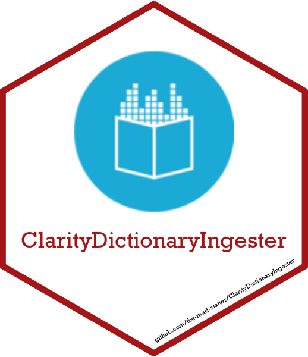

<!-- README.md is generated from README.Rmd. Please edit that file -->

# ClarityDictionaryIngester 

<!-- badges: start -->

[](https://www.repostatus.org/#wip)
[](https://lifecycle.r-lib.org/articles/stages.html#experimental)
[](https://github.com/the-mad-statter/ClarityDictionaryIngester/commits/main)
[-blue.svg)](https://cran.r-project.org/web/licenses/GPL%20(%3E=%203))
<br /> [](https://github.com/the-mad-statter/ClarityDictionaryIngester/actions)
[](https://github.com/the-mad-statter/ClarityDictionaryIngester/actions)
[](https://github.com/the-mad-statter/ClarityDictionaryIngester/actions)
[](https://codecov.io/gh/the-mad-statter/ClarityDictionaryIngester)
[](https://github.com/the-mad-statter/ClarityDictionaryIngester/actions)
<!-- badges: end -->

## Overview

The [EPIC Clarity
Dictionary](https://datahandbook.epic.com/ClarityDictionary) is a
centralized resource that helps one search the Clarity data model to
achieve reporting goals. The Dictionary is designed as a series of
webpages for a human to navigate and search for information, but this
design makes programmatic access difficult. Programmatic access to the
Dictionary facilitates accomplishing alternative goals such as analysis
of the available information in the Dictionary as well as automation of
data dictionary creation in a data brokerage setting.

The goal of
[{ClarityDictionaryIngester}](https://github.com/the-mad-statter/ClarityDictionaryIngester)
is to provide helpful functions for ingesting the EPIC Clarity
Dictionary into a database, thus enabling programmatic access.

## Usage

Setup

1.  If on Windows one option to manage database drivers and data sources
    is through the [ODBC Data Sources
    Administrator](https://learn.microsoft.com/en-us/host-integration-server/core/odbc-data-source-administrator).
2.  If using token authentication with tokens that expire, ensure the
    token is not expired.
3.  If connecting to a Databricks cluster, R will hang as the cluster
    starts up.

<!-- -->

    # 1. Connect to Database
    con <- clarity_dictionary_database_connect()

    # 2. Prepare Database (if needed)
    ## drop all dictionary tables to remove any dictionary data from the database
    clarity_dictionary_drop_all(con)

    ## initiate all dictionary tables if the tables do not yet exist
    clarity_dictionary_init(con)

    # 3. Select Tables for Processing
    ## Generate a vector of table names to ingest by comparing the names of 
    ## Clarity tables in the database to names of tables that have already been 
    ## ingested
    tables_to_ingest <- clarity_dictionary_select_tables_to_ingest(con)

    # 4. Setup Browser
    ## The ingestion process uses {Chromote}](https://github.com/rstudio/chromote)
    b <- clarity_dictionary_chromote_session_open()`

    # 5. Manual Login
    ## Go to the Chromote window and manually login.

    # 6. Ingest
    ## Start documentation ingestion
    clarity_dictionary_ingest(tables_to_ingest, b, con)

    # 7. On Error
    ## Check the log file "clarity_dictionary_ingester_log.csv" for clues.

    ## Depending on what went wrong, one could drop the last table (partially) 
    ## ingested and all associated records:
    tables_to_ingest <- clarity_dictionary_revert_last_table(con, tables_to_ingest)

    ## One could instead revert the entire database to a known good timestamp:
    clarity_dictionary_revert_all(con, "2024-03-07T14:19:08Z")

    ## The vector of table names to ingest should be updated accordingly and then 
    ## repeat Step 7.

    # 8. Clean Up
    ## Close the Chromote session:
    clarity_dictionary_chromote_session_close(b)

    ## Close the database connection:
    clarity_dictionary_database_disconnect(con)

Once the documentation for all tables has been ingested

    ## Query Full Dictionary in R:
    clarity_dictionary_select_all(con)

    ## Or produce the full query SQL syntax:
    clarity_dictionary_select_all_sql()

<br />

## Installation

You can install
[{ClarityDictionaryIngester}](https://github.com/the-mad-statter/ClarityDictionaryIngester)
from
[GitHub](https://github.com/the-mad-statter/ClarityDictionaryIngester)
with:

``` r
pak::pkg_install("the-mad-statter/ClarityDictionaryIngester")
```

If necessary [{pak}](https://github.com/r-lib/pak) can be installed
with:

``` r
install.packages(
  "pak", 
  repos = sprintf(
    "https://r-lib.github.io/p/pak/stable/%s/%s/%s", 
    .Platform$pkgType, 
    R.Version()$os, 
    R.Version()$arch
  )
)
```

<br />

## Code of Conduct

Please note that the
[{ClarityDictionaryIngester}](https://github.com/the-mad-statter/ClarityDictionaryIngester)
project is released with a [Contributor Code of
Conduct](https://contributor-covenant.org/version/2/0/CODE_OF_CONDUCT.html).
By contributing to this project, you agree to abide by its terms.

<br />

## Code Style

This repository attempts to follow the [tidyverse style
guide](https://style.tidyverse.org/index.html).

The use of [{styler}](https://github.com/r-lib/styler),
[{lintr}](https://github.com/r-lib/lintr), and
[{devtools}](https://github.com/r-lib/devtools) are recommended.

<br />

## About

### Washington University in Saint Louis 

Established in 1853, [Washington University in Saint
Louis](https://www.wustl.edu) is among the world’s leaders in teaching,
research, patient care, and service to society. Boasting 24 Nobel
laureates to date, the University is ranked 7th in the world for most
cited researchers, received the 4th highest amount of NIH medical
research grants among medical schools in 2019, and was tied for 1st in
the United States for genetics and genomics in 2018. The University is
committed to learning and exploration, discovery and impact, and
intellectual passions and challenging the unknown.
